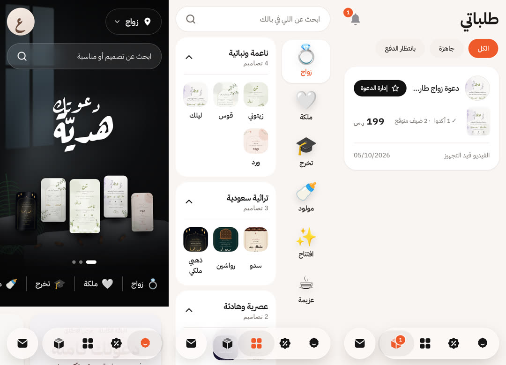
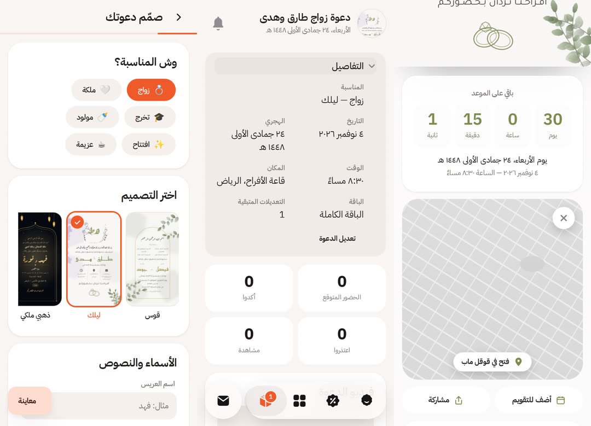

# عزيمة — دعوات رقمية متحركة مع تأكيد حضور

**Azeema** sells Saudi-style animated invitations. For about 199 SAR a customer gets:

- 🎬 **A 15-second animated video invitation** (1080×1920, ready for WhatsApp, Snapchat and Stories)
- 💌 **A guest page** that opens like an envelope, with a countdown, a map button, add-to-calendar and an RSVP form
- 📋 **A host dashboard** with live RSVP counts, guest messages, a CSV export, personal "إلى: فلان" links and a ready-made reminder message




**App UI:** Google **Material 3** components and tokens in a Saudi super-app layout, with spring physics and Apple-style micro-interactions. See [`DESIGN.md`](DESIGN.md) and [`ANIMATION.md`](ANIMATION.md).

## Designs

There are nine themes, all drawn in code as SVG and CSS, so there are no stock images or licensing issues:

| Theme | Style |
|---|---|
| **زيتوني** `sage` | White dahlias, sage watercolor, a Ruqaa monogram, stacked calligraphic names, an icon info row |
| **قوس** `arch` | Thin gold arch, watercolor eucalyptus, two-family host columns, «الابن / على / الابنة» |
| **ليلك** `lilac` | Hand-drawn ink wreath around the monogram, lavender watercolor, stretched kufi names, rings line-art |
| ذهبي ملكي `royal` | Navy with gold ogee arch, swinging lanterns, twinkling stars |
| سدو `sadu` | Najdi Al-Sadu weave bands (UNESCO-listed heritage pattern) |
| رواشين `hijazi` | Hijazi wooden mashrabiya window on teal |
| ورد `bloom` | Blush botanical sprigs |
| حبر `editorial` | Quiet-luxury ivory and ink |
| واحة `oasis` | Desert sunset, dunes and palms (for gatherings and كشتات) |

The botanical themes use **kashida typography** (`stretch()` inserts tatweel while keeping lam-alef ligatures and «ال» tight), dates in **Hijri Umm al-Qura plus Gregorian** with Arabic-Indic numerals, and self-hosted Arabic fonts (Aref Ruqaa, Tajawal, Reem Kufi, Amiri, El Messiri, IBM Plex Sans Arabic; all OFL).

## How it works

```
public/css/m3.css · app.css    ← Material 3 tokens + components · app screens (DESIGN.md)
public/js/motion.js · m3.js     ← spring physics → CSS linear() + component behaviours (ANIMATION.md)
public/js/shared/invite.js     ← ONE renderer used by the server, the builder preview and the video
public/js/shared/botanical.js  ← watercolor / foliage / dahlia / wreath generators + kashida
public/css/invite.css          ← themes + a single animation timeline (page mode vs video mode)
src/render.js                  ← headless Chromium seeks every animation frame-by-frame
                                 (Web Animations API) → JPEG → ffmpeg → H.264 MP4 + poster.jpg
server.js                      ← Express routes; node:sqlite storage (no native deps)
```

The video is rendered **deterministically**. Each frame sets `animation.currentTime` exactly, so nothing depends on timers. Several pages render interleaved frames in parallel; on 4 cores a video takes about 30 to 90 seconds.

## Run locally

```sh
cd azeema
npm install          # PLAYWRIGHT_SKIP_BROWSER_DOWNLOAD=1 if Chromium is already installed
npm run dev          # DEMO_MODE=1 → "تفعيل تجريبي" pays instantly
npm test             # API + renderer tests
npm run showcase     # renders marketing/videos/<theme>.mp4 + public/img/og.jpg
```

Requires Node ≥ 22.5 (`node:sqlite`), ffmpeg, and a Chromium that Playwright can launch.

## Configuration (env)

| Variable | Purpose |
|---|---|
| `BASE_URL` | Public URL, e.g. `https://azeema.sa`. Used in links, OG tags and payment return URLs |
| `ADMIN_KEY` | Opens `/admin?key=…` (orders, mark-paid, re-render) |
| `MOYASAR_SECRET_KEY` | Enables card, mada and Apple Pay checkout through Moyasar hosted invoices |
| `PAYMENT_LINK` | Fallback: a manual payment link (bank / STC Pay) that the admin confirms in `/admin` |
| `DEMO_MODE=1` | Instant test payments. **Never in production** |
| `WHATSAPP_CONTACT` | Support number shown in the footer (e.g. `9665XXXXXXXX`) |
| `DATA_DIR` | SQLite DB and rendered media (mount a volume) |
| `RENDER_WORKERS` | Parallel frame workers (default: min(4, CPUs)) |

Payment status is verified server-side by fetching the Moyasar invoice on return. Check the field names against Moyasar's current API docs before going live.

## Deploy

```sh
docker build -t azeema ./azeema
docker run -p 3000:3000 -v azeema-data:/data \
  -e BASE_URL=https://your-domain -e ADMIN_KEY=... -e MOYASAR_SECRET_KEY=... azeema
```

Any VPS with 2 or more vCPUs works. Put it behind HTTPS (Caddy or Nginx).

## Routes

| Route | Who |
|---|---|
| `/` · `/designs` · `/create` · `/demo/:theme` | Public |
| `/orders` | Customer: invitations saved on this device (`POST /api/my`) |
| `/checkout/:slug?key=` · `/host/:slug?key=` | Customer (secret host key) |
| `/i/:slug[?to=اسم]` · `/i/:slug/invite.ics` | Guests |
| `/admin?key=` | Operator |
| `/v/:slug?token=` | Internal: video timeline page for the renderer |

Marketing playbook: [`marketing/content-plan.md`](marketing/content-plan.md).
